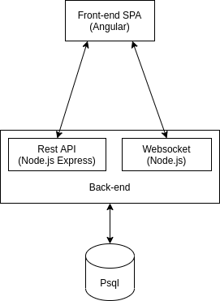

# REST API back-end for [Vinteres.io](https://vinteres.io/) - Find and match with people by personality and interests.

## Description

Back-end for [https://github.com/vinteres/client-spa](https://github.com/vinteres/client-spa). You can see more info and screenshots there.

## Setup

- Set config
- (DEV only) `export ENV=development`
- (PROD only) `export ENV=production`
- compile project `npm run tsc`
- run migrations `npm run migrate`
- Run `node db/db_seed.js`. Add static data to database from `db/db.sql`. Example `psql dating < /home/velizar/Workspace/vimeet-backend/db/db.sql`
- create Elasticsearch indexes `node db/es_seed.js`
- (DEV only) create local seed for dev `node db/seed.js`

- Or just run `./setup.sh` - Setups above steps for DEV env
